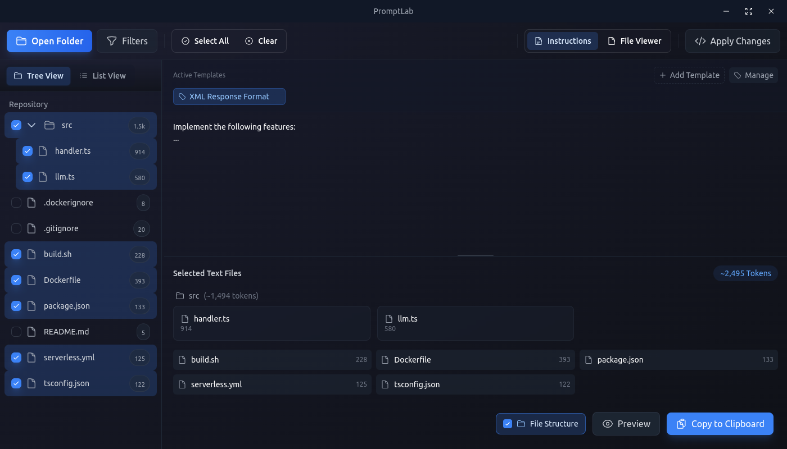

# PromptLab

A powerful desktop laboratory for crafting code-based prompts for Large Language Models. Built with Electron and React.



## Features

- 🧪 Transform your code into perfect LLM prompts
- 📁 Open and analyze any code repository
- 🔍 Select specific files or entire directories
- 🚫 Customizable ignore patterns with regex support
- 📝 Add custom instructions and save templates
- 🌳 Generate textual file tree visualization
- 📋 Copy formatted output to clipboard
- 🔢 Automatic token counting for LLM context limits

## Installation

### Linux
Download the latest `.AppImage` or `.deb` file from the [releases page](https://github.com/0xIbra/promptlab/releases).

#### AppImage
```bash
chmod +x PromptLab-*.AppImage
./PromptLab-*.AppImage
```

#### Debian/Ubuntu
```bash
sudo dpkg -i promptlab_*.deb
```

### Windows
Download and run the latest `.exe` installer from the [releases page](https://github.com/0xIbra/promptlab/releases).

### macOS
Download and install the latest `.dmg` file from the [releases page](https://github.com/0xIbra/promptlab/releases).

## Development

### Prerequisites
- Node.js 16+
- npm or yarn

### Setup
1. Clone the repository
```bash
git clone https://github.com/0xIbra/promptlab.git
cd promptlab
```

2. Install dependencies
```bash
npm install
```

3. Start development server
```bash
npm run dev
```

### Building
```bash
# Build for production
npm run build

# Create distributable
npm run dist
```

### Creating Releases

1. Update version in `package.json`
2. Create and push a new tag:
```bash
git tag v0.1.1
git push origin v0.1.1
```

This will trigger the GitHub Actions workflow that:
- Builds the app for Linux, Windows, and macOS
- Creates a new GitHub release
- Uploads all build artifacts to the release

## Contributing
Contributions are welcome! Please feel free to submit a Pull Request.

## License
This project is licensed under the MIT License - see the [LICENSE](LICENSE) file for details.

## Acknowledgments
- Built with [Electron](https://www.electronjs.org/)
- UI powered by [React](https://reactjs.org/) and [Tailwind CSS](https://tailwindcss.com/)
- Token counting by [gpt-tokenizer](https://www.npmjs.com/package/gpt-tokenizer)

